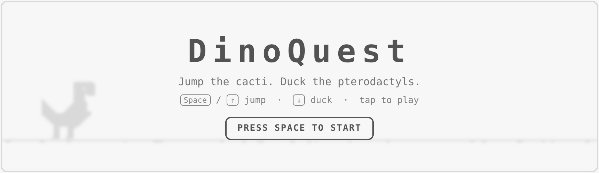
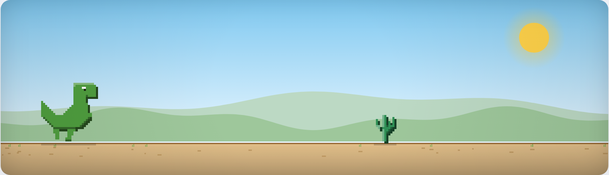
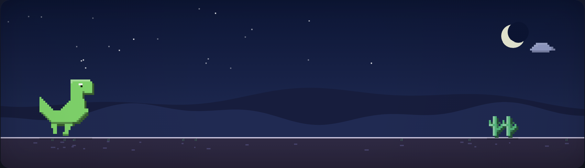
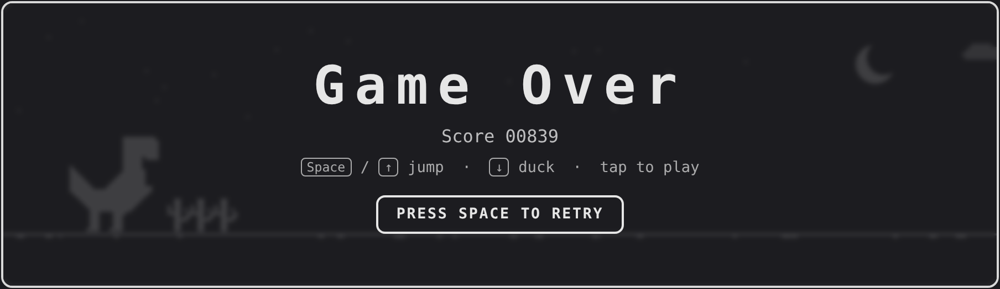

# DinoQuest

A Chrome-dinosaur-style endless runner, built with [Bun](https://bun.sh) and the
Canvas 2D API. Jump the cacti, duck the pterodactyls, and chase a high score as
the world speeds up and cycles between day and night.

Every sprite is drawn programmatically from character-grid "pixel maps", so the
game ships with **zero binary image assets**.

## Screenshots

| Title | Gameplay |
| --- | --- |
|  |  |

| Night mode | Game over |
| --- | --- |
|  |  |

## Controls

| Action | Keys | Touch |
| --- | --- | --- |
| Jump | `Space` · `↑` · `W` | Tap the top of the canvas |
| Duck | `↓` · `S` (hold) | Tap/hold the bottom of the canvas |
| Start / Retry | `Space` · `Enter` · click the button | Tap anywhere |

## Features

- Smooth, delta-timed game loop on `requestAnimationFrame` (frame-rate independent).
- Jump physics with gravity and a fast-fall when ducking mid-air.
- Cacti (small, large, and clustered) plus pterodactyls at three heights.
- Speed ramps up over time; obstacle spacing tightens to match.
- Day/night cycle with a smooth color blend, crescent moon, and stars.
- High score persisted in `localStorage`.
- HiDPI-aware rendering and responsive, mobile-friendly layout.

## Getting started

Requires [Bun](https://bun.sh) (developed against 1.1.x).

```sh
# install dependencies (optional — only needed for the screenshot tool)
bun install

# run with hot reload
bun run dev

# or run the plain server
bun run start
```

Then open <http://localhost:3000>. Set a custom port with `PORT=8080 bun run start`.

## Project structure

```
dinoquest/
├── server.ts          # Bun static file server (with path-traversal guard)
├── public/
│   ├── index.html     # page shell + HUD + start/game-over overlay
│   ├── style.css      # day/night theming, responsive layout
│   └── game.js        # game loop, physics, sprites, rendering
├── shot.mjs           # optional Playwright screenshot harness (dev only)
└── screenshots/       # README images
```

## Regenerating screenshots (optional)

The images above are produced by `shot.mjs`, which drives the running game with
Playwright:

```sh
bun run start            # in one terminal
bun shot.mjs             # in another — writes to screenshots/
```

This needs a Chromium build (`npx playwright install chromium`) and its system
libraries. It is purely a development convenience and is not required to play.
